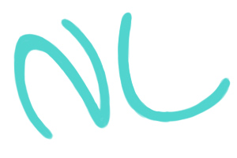

    
  

    <b>NothingLeft</b>
  

    A time management system based on GTD.
  

    
    

# NothingLeftProject-Document

- 本文档是「NothingLeftProject」的文档，涵盖关于这个项目的所有方面

  - 不管你是想要快速上手使用  还是  希望一起开发/二次开发

    都可以在这里找到你需要的答案！

- 如果您有更好地意见或者什么发现，请务必提出来，让我们一起协同进步：[feedback.hadream.ltd](http://feedback.hadream.ltd)

- 本项目由Lanzhijiang开发维护，邮箱：lanzhijiang@foxmail.com

## 前言-Preface
- **我们是什么-What:**
  - NothingLeft（NL）是一套以GTD为核心的时间管理系统
  - 我们以GTD为核心以及别的理念，设计了一整套的功能，帮助您解决团队/个人的安排
- **我们的目的-Purpose:**
  - 现代人们的生活事务繁忙，就算是学生也不得不在高中的时候抱怨道时间不够用
  - 然而这并不是无解的。一个好的时间管理系统可以在很大程度上帮到我们，让我们的生活变得更充实，更紧致有序
  - 那么，时间管理系统有很多，但我个人最喜欢的一种就是GTD。它使你的计划分明，然而又与一般的to-do list不同
  - 所以，本项目就正是一个基于GTD理念而开发的时间管理平台。我们希望您在接触本平台之后，你能感觉到时间变得充裕起来，事情也变得简单起来。
- **为什么选择我们-Why:**
  - 但是，为何非使用本平台不可呢？不可以用纸或者便利贴、日历什么的来实现GTD吗？
  
    可以，完全没有问题，我只是提供一个相较于以上方案都更加贴合现代生活、且确实更加方便的方案
  - 方便在哪里？
    - 对于纸质的记录工具，其损坏的可能性较高且不好编辑与整理，你可能会花上不少的时间来完成GTD的步骤（如果你使用纸质工具的话）
    - 那么我们来看看方便携带的手机如何？然而，只要是使用过的人都知道，手机顶多可以作为一个提醒工具，如果你要在上面进行stuff的收集或整理，都会变得相当不便
    - 此时，最好的选择当然就是本项目。我们具有强大的跨平台性能（WEB/DESKTOP/MOBILE/SMARTDEVICE），而且本项目的后端API甚至允许你开发你自己喜欢的前端（仅限NothingLeft-经典系统）
- **关于隐私性-Privacy:**
  - 如果你是用户，本项目提供两套产品以解决不同的需求：

    - 1、你是电脑pro或者团队管理者，那么我推荐您使用「NothingLeft-经典系统」来满足您的需求

      - 在这个解决方案下，NothingLeft呈现为中心结构，分为服务端和客户端，隐私由运行该NothingLeft服务端的负责人负责

    - 2、你是小白，想要快速上手，那么你可以选择「NothingLeft-一体系统」或者 使用「经典系统」的客户端但连接大棚NL服务提供商提供的服务端

      - 区别在于，一体系统不允许多设备同步，最多实现局域网内双设备同步

        而经典系统则允许任何时间、任何地点，只要可以连接到NL服务端，即可一个账户下同步

## 阅读指导
- 现在，您可以
- 你是想要快速上手的「用户」？立即使用本产品的话，请根据你的需求进行选择：
  - 你是电脑pro或者团队管理者，想要折腾或者为团队工作提供解决方案。则我推荐您使用「NothingLeft-经典系统」
    - [点击以了解「NothingLeft-经典系统」]()
  - 你是小白，想要快速上手。则我将推荐你使用「NothingLeft-一体系统」或者「NL-经典系统」的客户端
    - [点击以了解「NothingLeft-一体系统」]()
    - [点击以了解「NothingLeft-经典系统」]()
- 你是想要一起或者进行二次开发的个人开发者？那么你可以先了解一下本项目的设计，这将会对你介入本产品有所帮助，[点击以了解]()
- 本文档地址托管于github上，有兴趣可以[点击以查看](https://github.com/NothingLeft/ProjectDocs)